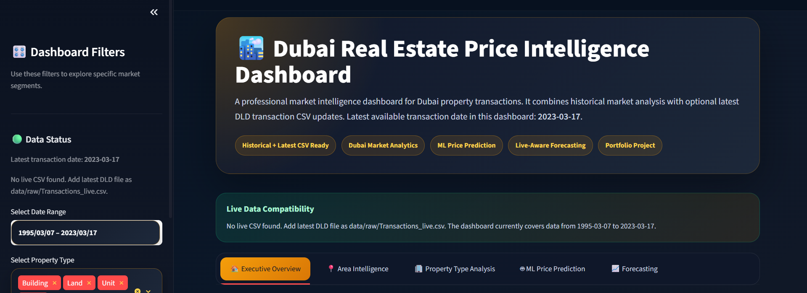
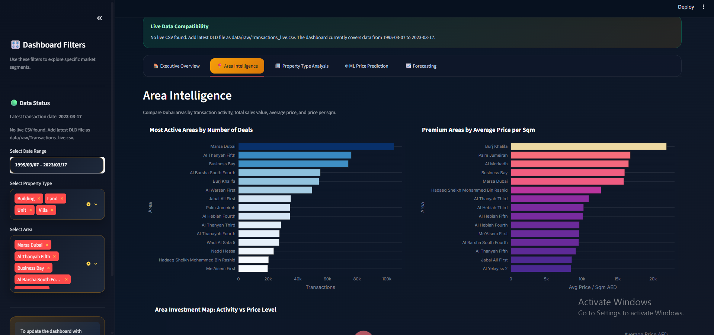
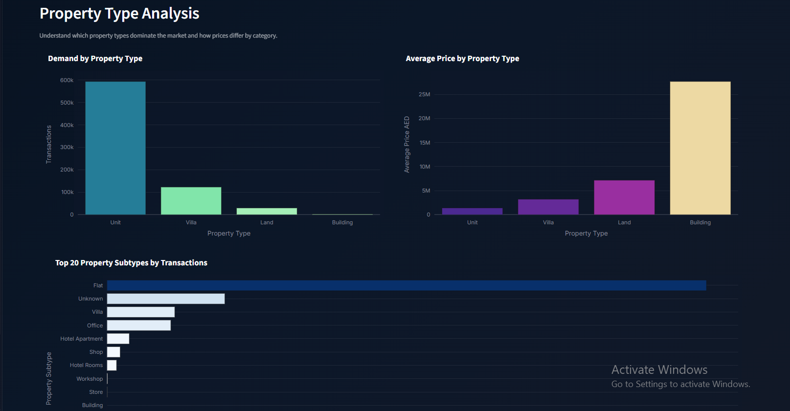
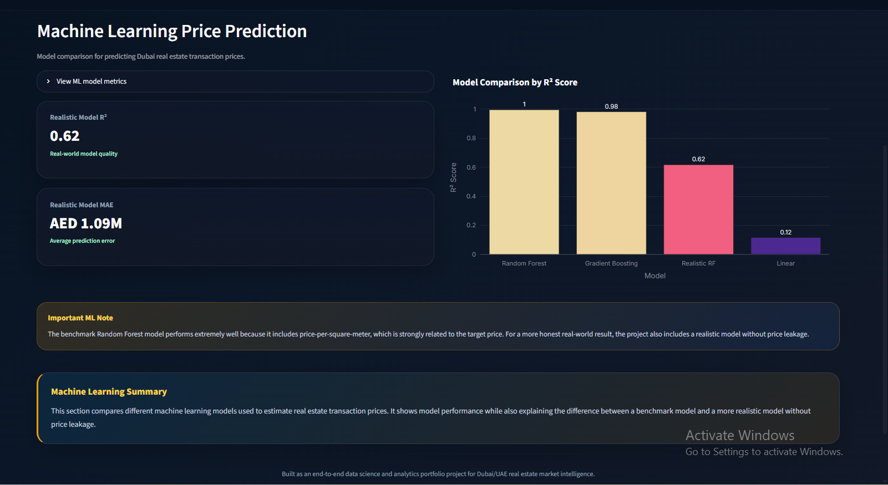
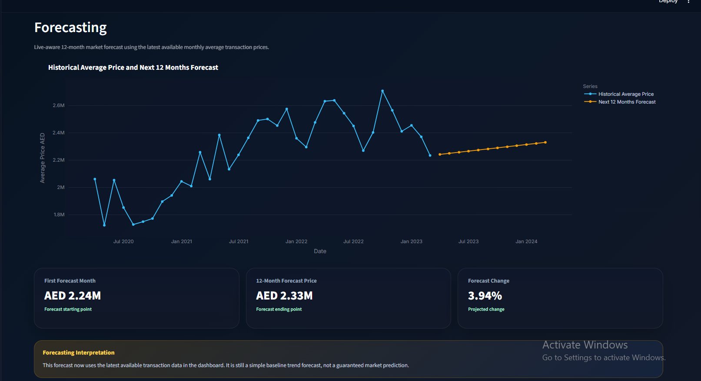

# Dubai Real Estate Price Intelligence Dashboard

An end-to-end Data Science and Data Analytics portfolio project focused on Dubai real estate transaction intelligence.

This project includes data collection, data cleaning, exploratory data analysis, SQL analysis, machine learning price prediction, market forecasting, and an interactive Streamlit dashboard.

## Project Goal

The goal of this project is to build a Dubai/UAE job-market relevant portfolio project for Data Analyst and Data Scientist roles.

The dashboard helps users understand:

- Dubai real estate transaction activity
- Area-wise sales performance
- Property type demand
- Average transaction prices
- Price per square meter trends
- Machine learning model performance
- 12-month price forecasting
- Optional latest DLD CSV compatibility

## Tools Used

- Python
- Pandas
- NumPy
- Matplotlib
- Seaborn
- Plotly
- Scikit-learn
- SQLite
- Streamlit
- Jupyter Notebook
- Git & GitHub

## Project Structure

```text
dubai-real-estate-price-intelligence-dashboard/

dashboard/
└── streamlit/
    ├── app.py
    └── requirements.txt

data/
├── external/
│   ├── initial_data_dictionary.csv
│   ├── raw_transactions_sample.csv
│   └── cleaning_summary.csv
│
├── processed/
│   └── Processed files are regenerated locally by running notebooks
│
└── raw/
    └── Transactions.csv is not uploaded due to file size

notebooks/
├── 01_data_collection.ipynb
├── 02_data_cleaning.ipynb
├── 03_eda_analysis.ipynb
├── 04_sql_analysis.ipynb
├── 05_ml_price_prediction.ipynb
└── 06_forecasting.ipynb

reports/
└── figures/
    └── Saved charts and visual outputs

sql/
├── create_tables.sql
├── analysis_queries.sql
└── business_questions.sql

src/
├── data_cleaning.py
├── feature_engineering.py
├── model_training.py
└── utils.py

requirements.txt
README.md
.gitignore
```

## Dashboard Pages

The Streamlit dashboard includes:

- Executive Overview
- Area Intelligence
- Property Type Analysis
- Machine Learning Price Prediction
- Forecasting
## Dashboard Preview

### Executive Overview


### Area Intelligence


### Property Type Analysis


### Machine Learning Price Prediction


### Forecasting


## Key Features

### 1. Data Collection

The project uses Dubai real estate transaction data.

The full raw transaction dataset is not included in this repository because of file size. A small sample file is included for review purposes.

### 2. Data Cleaning

Cleaning steps include:

- Standardizing column names
- Handling missing values
- Parsing transaction dates
- Creating year, month, quarter, and year-month fields
- Removing invalid records
- Creating price-per-square-meter feature
- Preparing dashboard-ready data

### 3. Exploratory Data Analysis

EDA includes:

- Monthly transaction trend analysis
- Area-wise sales value analysis
- Area-wise transaction volume analysis
- Property type distribution
- Average price by area
- Average price per square meter
- Registration type analysis
- Parking and property subtype analysis

### 4. SQL Analysis

SQLite is used to answer business questions such as:

- Which areas have the highest sales value?
- Which areas have the highest transaction volume?
- Which property types are most active?
- Which areas are premium by price per square meter?
- How does market activity change over time?
- Which registration types dominate the market?

### 5. Machine Learning

The project trains and compares multiple regression models for transaction price prediction:

- Linear Regression
- Gradient Boosting Regressor
- Random Forest Regressor
- Realistic Random Forest without price leakage

The project also explains the difference between a benchmark model and a more realistic model to demonstrate practical machine learning understanding.

### 6. Forecasting

The project includes a 12-month average transaction price forecast using monthly historical trend data.

The Streamlit dashboard is also compatible with newer DLD CSV files. If a newer transaction CSV is added locally, the dashboard can update the latest available transaction date and forecast.

### 7. Streamlit Dashboard

The dashboard includes:

- Dark premium UI
- Interactive filters
- Executive KPIs
- Area intelligence charts
- Property type analysis
- ML model comparison
- Forecasting view
- Plain-English section summaries
- Detailed data tables

## Dataset Note

The full raw transaction dataset is not included in this repository because of file size.

To run the full project locally, place the raw transaction file inside:

```text
data/raw/Transactions.csv
```

Processed dashboard files can be regenerated by running the notebooks step by step.

For optional latest data compatibility, place the latest DLD transaction CSV inside:

```text
data/raw/Transactions_live.csv
```

## How to Run

### 1. Clone the repository

```bash
git clone https://github.com/ummehanirashid08/dubai-real-estate-price-intelligence-dashboard.git
cd dubai-real-estate-price-intelligence-dashboard
```

### 2. Create a virtual environment

```bash
python -m venv .venv
```

### 3. Activate the virtual environment

Windows PowerShell:

```bash
.\.venv\Scripts\Activate.ps1
```

### 4. Install dependencies

```bash
pip install -r requirements.txt
```

### 5. Add dataset locally

Place the raw transaction file here:

```text
data/raw/Transactions.csv
```

### 6. Run notebooks

Run the notebooks in this order:

```text
01_data_collection.ipynb
02_data_cleaning.ipynb
03_eda_analysis.ipynb
04_sql_analysis.ipynb
05_ml_price_prediction.ipynb
06_forecasting.ipynb
```

### 7. Run the Streamlit dashboard

```bash
streamlit run dashboard/streamlit/app.py
```

## Business Value

This project can help real estate analysts, investors, brokers, and business teams understand Dubai property market movement through:

- Market size tracking
- Area-level intelligence
- Property type demand analysis
- Price level comparison
- Forecasting
- Machine learning based price estimation

## Portfolio Value

This project demonstrates:

- Data cleaning
- Exploratory data analysis
- SQL analysis
- Business intelligence thinking
- Machine learning model comparison
- Forecasting
- Dashboard design
- Data storytelling
- GitHub project structuring
- Dubai/UAE market relevance

## Target Roles

This project is designed for portfolio submission for:

- Data Analyst roles
- Data Scientist roles
- Business Intelligence Analyst roles
- Real Estate Data Analyst roles
- Junior Machine Learning roles

## Status

Project uploaded as a portfolio-ready GitHub repository.